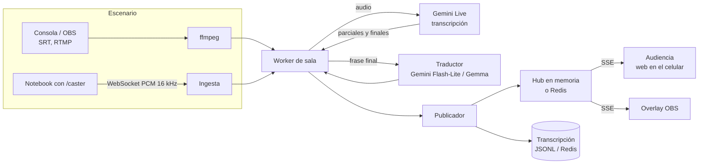

# Vozviva

Subtítulos en vivo, abiertos, para conferencias con varias salas en paralelo.

Vozviva toma el audio de cada escenario y publica subtítulos en tiempo real en el idioma original y traducidos (al español, y al inglés cuando la charla es en español). La audiencia abre una página en el celular, elige la sala y el idioma, y lee. Nació para la Vibeathon de Nerdearla 2026: que las conferencias open source puedan ser accesibles sin depender de herramientas comerciales caras ni de operación manual.

Licencia: MIT (aprobada por la Open Source Initiative).

Autor: [tu nombre completo]. Proyecto individual presentado a la Vibeathon de Nerdearla 2026, co-creado con Claude, modelo de IA de Anthropic.

Cómo responde a cada criterio de evaluación de la Vibeathon (calidad, latencia, escalabilidad, despliegue y operación, innovación): [docs/CRITERIOS.md](docs/CRITERIOS.md).

## Qué hace

- **Audio en vivo → subtítulos.** Parciales que se actualizan mientras el orador habla y frases finales cuando hace una pausa.
- **Varias salas a la vez.** Cada sala es un worker independiente: si una se cae, las demás siguen. Probado con 6 salas simultáneas en modo demo; el límite real lo pone la cuota de la API y la red, no el servidor.
- **Traducción.** Idioma original + español y portugués; si la charla es en español, inglés y portugués. Salas con idioma variable (`source_lang: auto`) detectan el idioma y traducen a ambos.
- **Español fácil.** Un canal más con el contenido en formato de Lectura Fácil: oraciones cortas, una idea por oración, vocabulario cotidiano y términos técnicos explicados. Ayuda a personas con discapacidad intelectual, a quienes tienen el español como segunda lengua (entre ellas, muchas personas sordas usuarias de lengua de señas) y a quienes no conocen la jerga.
- **Tocá una frase y te la explico.** Cualquier persona toca una línea de subtítulo que no entendió y recibe, solo para ella, qué quiso decir el orador y qué significan los términos técnicos de esa frase, en el idioma que está leyendo y con el contexto de la charla. Cada explicación se genera una sola vez por frase, así el costo depende de cuántas frases se explican y no de cuánta gente toca.
- **¿Qué me perdí?** Un botón resume lo dicho en los últimos 5, 10, 15 o 30 minutos, en el idioma que la persona está leyendo. Para quien llega tarde o cambia de sala. Un resumen se reutiliza durante 30 segundos, así cien personas tocando el botón a la vez generan una sola llamada.
- **Agenda del evento.** Con la agenda cargada, la audiencia ve el título y los oradores de la charla en curso, y cada sala arma sola su glosario (nombres de oradores, siglas y productos del título y el resumen del programa) y le pasa el contexto de la charla al traductor y a los resúmenes. El archivo se relee solo si cambia. La transcripción se puede exportar por charla.
- **Vista para la audiencia.** Web pensada para leer desde el celular en una sala a oscuras: elegís sala e idioma, letra grande y ajustable, tema claro u oscuro, la pantalla no se apaga, y podés descargar la transcripción en TXT, SRT o VTT.
- **Lectura en voz alta.** El botón "Escuchar" lee cada frase nueva con la voz del sistema del celular, en el idioma elegido y con velocidad ajustable (1× a 1,75×). Pensado para personas ciegas o con baja visión: no tiene costo ni depende de la red, y si la lectura se atrasa salta a lo último para no quedar desfasada del escenario. Mientras está activa, la página deja de anunciar al lector de pantalla para no leer dos veces.
- **Overlay para OBS y pantallas del escenario** (`/overlay?s=<sala>&l=<idioma>`), con fondo transparente.
- **Monitor de ritmo para el orador** (`/orador?s=<sala>`): una pantalla para el monitor del escenario que avisa con color y texto grande cuando el orador habla demasiado rápido para que los subtítulos y la traducción lo sigan (palabras por minuto y demora medida), y cuánto tiempo le queda según la agenda. Se muestra en el idioma de la charla. En buen ritmo queda discreta; solo pide atención cuando hace falta.
- **Carteles con QR** (`/carteles`): un cartel A4 imprimible por sala, con un código QR que abre los subtítulos de esa sala e instrucciones de uso.
- **Tablero de operación** (`/ops`): nivel de audio, último audio, último subtítulo, audiencia y errores por sala, más latencia medida (voz → texto y traducción, mediana y p95), tokens consumidos y costo estimado si configurás los precios.
- **Ingesta flexible.** Cualquier entrada que lea ffmpeg (SRT, RTMP, RTSP, HLS, placa de audio, archivo) o una notebook que manda el audio desde el navegador (`/caster`), protegida con clave.
- **Glosario.** Nombres propios, productos y siglas que el reconocimiento y la traducción deben respetar.

## Probalo en 1 minuto (sin API key)

```bash
pip install -r requirements.txt
python -m vozviva serve -c config.demo.yaml
# abrí http://localhost:8000
```

O con Docker, sin instalar nada: `docker compose --profile demo up --build demo`.

El modo demo (`backend: mock`) genera frases de ejemplo en 6 salas para probar la interfaz, el despliegue y la carga de audiencia sin gastar créditos.

## Con Gemini

```bash
cp config.example.yaml config.yaml    # editá las salas
cp .env.example .env                  # poné GEMINI_API_KEY y VOZVIVA_CASTER_TOKEN
export $(cat .env | xargs)
python -m vozviva check -c config.yaml
python -m vozviva serve -c config.yaml
```

Para simular una charla en vivo con un archivo, agregá una sala así:

```yaml
  - id: demo
    name: Demo con archivo
    source_lang: en
    input: charla.mp3
    realtime: true
    loop: true
```

Para medir la calidad contra una transcripción humana: `python scripts/evaluar.py referencia.txt transcripcion.txt --terminos "Kubernetes,SLO"` (tasa de error por palabra y aciertos en términos técnicos).

Antes del evento, corré `python scripts/probar_gemini.py charla.mp3` para ver la respuesta cruda del modelo en vivo con tu clave (sirve para confirmar formato, latencia y calidad).

Con Docker:

```bash
docker compose up --build vozviva
```

## Backends

| Backend | Qué usa | Latencia esperada | Estado |
|---|---|---|---|
| `gemini_live` (recomendado) | `gemini-3.5-transcribe-live` para transcribir en streaming + `gemini-3.5-flash-lite` para traducir cada frase | parciales casi inmediatos; traducción al cerrar cada frase | probado con sesión simulada, falta prueba con la API real |
| `gemini_live_translate` | `gemini-3.5-live-translate-preview` (interpretación simultánea), una conexión por idioma | la más baja para el canal traducido | experimental |
| `gemini_chunked` | VAD local + `generate_content` con audio (transcribe y traduce en una llamada) | duración del fragmento + ~1 s | respaldo si falla la Live API |
| `local` | faster-whisper + Gemma vía Ollama; nada sale de la máquina | depende de la GPU | experimental |
| `mock` | frases de ejemplo | — | para demos |

Las latencias son estimaciones de diseño, no mediciones.

## Arquitectura



Decisiones:

- **SSE para la audiencia** en lugar de WebSocket: funciona detrás de cualquier proxy, reconecta solo y alcanza para tráfico de una sola dirección. Al reconectar, el servidor manda un snapshot y el cliente lo fusiona por número de segmento, así que no hay duplicados.
- **Rotación de sesiones Live**: la documentación indica un máximo de 10 minutos por sesión de transcripción en vivo. Vozviva rota a los 9 minutos, esperando un silencio; mientras abre la conexión nueva el audio queda en cola, así que no se pierde.
- **Traducción por frase final** (no por parcial): evita que el texto traducido "baile" y reduce llamadas.
- **Redis opcional**: con un solo servidor no hace falta. Para muchas salas o mucha audiencia, los nodos que procesan audio publican en Redis y los nodos web reparten a la audiencia.

## API

| Ruta | Descripción |
|---|---|
| `GET /` | Vista de audiencia (`?s=<sala>&l=<canal>` abre directo) |
| `GET /caster` | Enviar audio desde el navegador |
| `GET /overlay?s=&l=&lines=2&size=6vh` | Overlay para OBS |
| `GET /ops` | Tablero de operación |
| `GET /carteles?base=&s=` | Carteles A4 con QR para imprimir |
| `GET /orador?s=` | Monitor de ritmo para el escenario |
| `GET /api/sessions/{sala}/explain?channel=es&seg=12` | Explicación de una frase |
| `GET /api/sessions/{sala}/pace` | Ritmo del orador y demora de subtítulos |
| `GET /api/sessions/{sala}/summary?channel=es&minutes=10` | Resumen "¿Qué me perdí?" |
| `GET /api/sessions/{sala}/qr.svg` | Código QR de la sala |
| `GET /api/agenda` | Charlas cargadas y errores de la agenda |
| `GET /api/sessions` | Salas, canales, si están en vivo, audiencia |
| `GET /api/sessions/{sala}/stream?channel=es` | Server-Sent Events con los subtítulos |
| `GET /api/sessions/{sala}/transcript?channel=es&format=srt&talk=<id>` | Transcripción (`txt`, `srt`, `vtt`), opcionalmente de una sola charla |
| `GET /api/status` | Estado detallado de cada sala |
| `WS /ingest/{sala}?token=` | Audio PCM s16le 16 kHz mono |

Los canales son `orig` (idioma original), los códigos de idioma destino (`es`, `en`) y `facil` (español en Lectura Fácil).

## Agenda

```yaml
# agenda.yaml (ver agenda.example.yaml)
talks:
  - id: observabilidad
    session: auditorio
    start: 2026-09-25 10:00
    end: 2026-09-25 10:45
    title: Observabilidad con OpenTelemetry
    speakers: [Nombre Apellido]
    abstract: Resumen del programa.
    glossary: [SLO, eBPF]
```

En `config.yaml`: `agenda: agenda.yaml` y `timezone: America/Argentina/Buenos_Aires`. Quince minutos antes de cada charla, la sala ya prepara el glosario de la próxima; con el backend `gemini_live`, el glosario nuevo entra en la siguiente reconexión, que se hace en un silencio.

## Tests

```bash
pip install pytest
python -m pytest -q
```

Cubren el VAD, el armado de frases, la exportación SRT/VTT, el flujo completo con una sesión de Gemini Live simulada (incluida la medición de latencia), el backend por fragmentos con un cliente simulado, la lectura de audio con ffmpeg, la agenda y el glosario automático, el canal de lectura fácil, los resúmenes, los QR y el cálculo de costos.

## Limitaciones conocidas

- La transcripción en vivo se probó con la API real y audio de un video en inglés; los tests reproducen esa salida real. Los otros backends de Gemini (`gemini_chunked`, `gemini_live_translate`) y el modo `local` no se probaron todavía contra el servicio real.
- Sin diarización: no distingue quién habla (la transcripción en vivo de Gemini no la soporta en streaming).
- Los tiempos del SRT son relativos al inicio del audio de cada sala y se reinician si el worker se reinicia.
- El VAD local es por energía: funciona bien con audio de consola, peor con micrófono ambiente y mucho ruido.
- La página `/caster` necesita `https://` (o `localhost`) para acceder al micrófono.
- El canal de español fácil lo genera un modelo: sigue las pautas de Lectura Fácil pero no reemplaza la validación con personas usuarias, que es parte de la norma.
- Sin API key (o en modo demo), "¿Qué me perdí?" muestra frases textuales del tramo en lugar de un resumen, y lo aclara en pantalla.
- El glosario automático usa una heurística (siglas, CamelCase, palabras con mayúscula): puede sumar algún término irrelevante o perder alguno en minúscula; el campo `glossary` de cada charla lo complementa.
- Los umbrales del monitor de ritmo (170 y 200 palabras por minuto, 4 y 7 segundos de demora) son valores de partida razonables, no medidos con personas usuarias: ajustalos con `pace_wpm_warn`, `pace_wpm_alert`, `pace_lag_warn_s` y `pace_lag_alert_s`.
- Sin API key, "Tocá una frase" solo muestra definiciones de ejemplo del modo demo, y lo aclara.
- Los tokens de la Live API se suman mensaje a mensaje según `usage_metadata`; conviene contrastar el total con la consola de Google AI Studio.

## Próximos pasos

- Lengua de señas (LSA): traducción de señas a texto y de texto a señas, cuando existan modelos con soporte real para LSA, desarrollada junto con la comunidad sorda.
- Audio traducido para la audiencia (el modelo de traducción en vivo ya lo devuelve; hoy se descarta).
- Voces neuronales opcionales (Gemini TTS) para la lectura en voz alta.
- Panel para corregir el glosario durante el evento.
- Publicar la transcripción revisada junto al video de cada charla.

## Cómo se hizo

Vozviva se diseñó y programó en conversación con Claude (Anthropic): la arquitectura, el código, los tests y la documentación salieron de ese trabajo conjunto; las decisiones de producto, la elección de funciones y las pruebas con la API real son del autor. Lo contamos porque es parte de lo que muestra esta Vibeathon: cómo se construye software con IA.

## Documentación

- [Guía de despliegue para una conferencia](docs/DESPLIEGUE.md)
- [Criterios de evaluación: cómo se cumplen y cómo verificarlo](docs/CRITERIOS.md)
- [Texto de presentación y guion de demo](docs/PRESENTACION.md)
